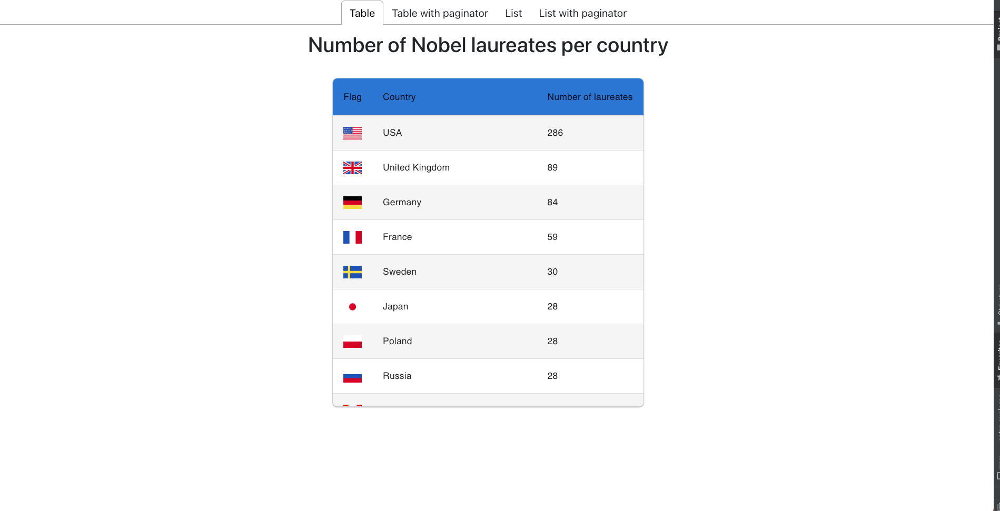
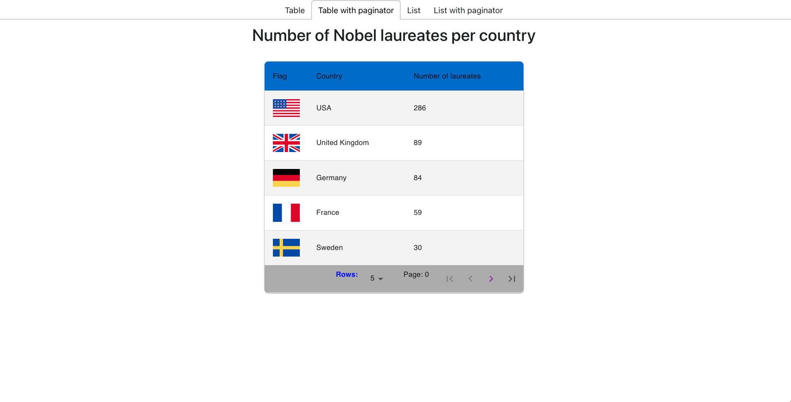
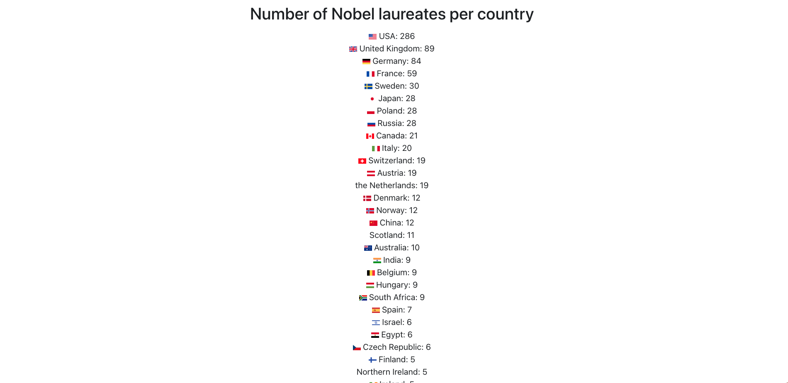
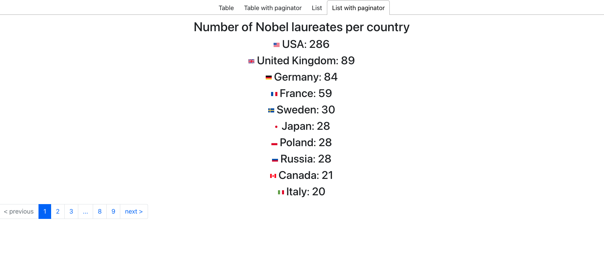

# nobe-laureates-app
Information about the Nobel Prizes and the Nobel Prize Laureates.

## Getting Started
* Install `npm` dependencies for NodeJS backend service :
    ```
    npm install --save-dev
    ```

* Install `npm` dependencies for frontend service:
    ```
    cd ui
    npm install --save-dev
    ```
* Run project
  * development mode
    * run backend service `npm run build:start:express:dev`
    * run frontend service `cd ui && npm run start:ui:dev`
  * production mode
    * run backend services `npm run build:start:express`
    * run frontend services `npm run start:ui`
* Tests
  * **Unit tests (backend) -** `npm run test` script

## Google Cloud Deployment

* GCP deployment to VM
  * components
    * [NGINX](https://nginx.org/en/)
    * Backend ([Express](https://expressjs.com/))
    * Frontend ([React](https://create-react-app.dev/))
    * GCP [Compute Engine](https://cloud.google.com/compute/)
    * GCP [Static IP](https://cloud.google.com/compute/docs/ip-addresses/reserve-static-external-ip-address)
  * NGINX
    * configuration
  ```
  server {
    listen 80;
    server_name wach.quest;
    location / {
        
        # proxy traffic to the ui server
        
        proxy_set_header X-Forwarded-For $proxy_add_x_forwarded_for;
        proxy_set_header Host $host;
        proxy_pass http://127.0.0.1:3000;
        proxy_http_version 1.1;
        proxy_set_header Upgrade $http_upgrade;
        proxy_set_header Connection "upgrade";
        
        # proxy traffic to the backend Express server
  
        location /api/laureate-count {
             proxy_pass http://127.0.0.1:9000$request_uri;
             proxy_redirect off;
        }
    }
  }
  
  ```
## Backend Express
* [API documentation](https://olexxandr.github.io/nobel-laureates-app/) is hosted with help of [GitHub](https://docs.github.com/en/pages) 
## UI ReactJS

Frontend uses [ReactJS](https://reactjs.org/) and [Material UI framework] (https://mui.com/material-ui/)
* [Material UI table](https://mui.com/material-ui/react-table/)
  

* [Material UI table wit paginator](https://mui.com/material-ui/react-table/)
  

* List
  
* List with custom paginator
    
